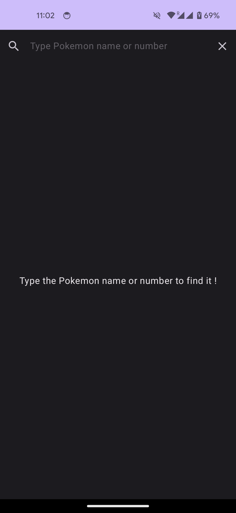
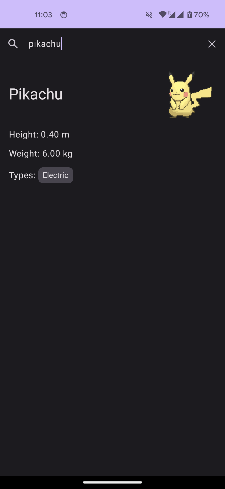

This is a simple Android app allowing user to search for a Pokemon by name (in lowercase only) or id (number) using [PokeApi](https://pokeapi.co/).

When found, it displays some basic information about the Pokemon and its picture as a gif.

## Screenshots

| Empty                          | Result                          |
|--------------------------------|---------------------------------|
|  |  |

## Architecture

The app has 2 layers: UI and Data in their own package `ui` and `data`.
There is another package `di` that contains Hilt module for dependency injection.

### UI

The UI has a single Activity and screen: `MainActivity` that sets the composable screen `SearchScreen`.

It uses MVVM architecture. `SearchScreen` uses the `SearchViewModel` and data to display is passed through `SearchUiState` using a `StateFlow`.

### Data

The entry point to the data layer is the `PokemonRepository` that returns a `Pokemon` instance.

Behind the scene it uses `PokeApiService`, which is a Retrofit interface to the [PokeApi](https://pokeapi.co/). It is located in the subpackage `remote` and uses its own models like `RemotePokemon` that are then converted into `Pokemon`.

## Libraries

- UI: [Jetpack Compose](https://developer.android.com/jetpack/compose)
- Images: [Coil](https://coil-kt.github.io/coil/)
- DI: [Hilt](https://developer.android.com/training/dependency-injection/hilt-android)
- Network API calls: [Retrofit](https://square.github.io/retrofit/)
- Mocking: [Mockito](https://github.com/mockito/mockito)
- Assertions: [AssertJ](https://assertj.github.io/doc/)

## Testing

- There are unit tests for most of the logic under the `test` folder.
- The `PokeApiService` is tested in `PokeApiServiceTest` using Okhttp MockWebserver and Robolectric under the `test` folder.
- The composable screen is tested in `SearchScreenInternalTest` that uses `ComposeTestRule` to check that components are displayed correctly. It is in the `androidTest` folder.
- There is also an integration test in `SearchIntegrationTest` in `androidTest` folder that tests the entire search feature. Only the API calls are mocked using Hilt testing library.

